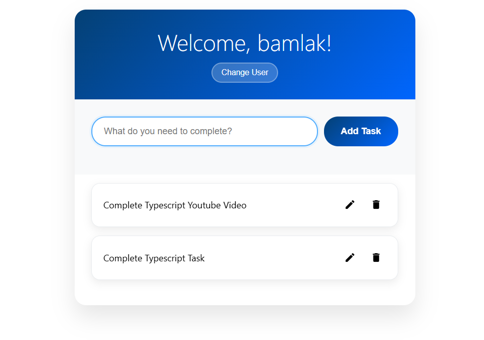

# Todo List with TypeScript (HTML/CSS/JS/TypeScript)

Small, client‑side todo app. Built with plain HTML, CSS, JavaScript and TypeScript.

## Features
- Add tasks
- Edit tasks
- Delete tasks
- Change greeting name (per user)
- Saves tasks and name in your browser (localStorage)

## Screenshots 

1. To-do-list
   
   

## Run
1. Clone or download this repository.
2. Open the project folder in VS Code.
3. Install and enable the "Live Server" extension.
4. Open index.html and click "Go Live" (or right-click → "Open with Live Server").

